# platform-observability-stack

A production-style observability platform built from scratch on AWS EKS and managed
entirely through GitOps. It instruments a real sample application with the three
pillars of observability (metrics, logs, and traces), then layers service level
objectives, error budgets, burn-rate alerting, and chaos engineering on top.

The goal of the project is to show, end to end, how a platform team would stand up
reliable infrastructure with Terraform, deploy and operate workloads with ArgoCD and
Helm, and answer the questions that matter in production: Is the service healthy? How
do we know? When something breaks, how fast do we find out, and how do we prove the
system recovers?

```
        Sample application:  frontend (React)  ->  backend (FastAPI)  ->  PostgreSQL
                                                       |
                  +------------------------------------+------------------------------------+
                  |                                    |                                    |
               Metrics                               Logs                                Traces
          backend /metrics                      stdout per pod                    OpenTelemetry SDK
                  |                                    |                                    |
            Prometheus  <- scrape            Promtail -> Loki                  OTel Collector -> Tempo
                  |                                    |                                    |
                  +------------------------------------+------------------------------------+
                                                       |
                                                    Grafana
                                  (dashboards: cluster, app, SLO, error budget)
                                                       |
                                            SLI / SLO recording rules
                                                       |
                                         multi-window burn-rate alerts
                                                       |
                                                 Alertmanager  ->  Slack

   Delivery:   Git repo  ->  ArgoCD (app-of-apps)  ->  Helm charts + manifests  ->  EKS
   Resilience: LitmusChaos pod-delete experiments validate recovery and the alerts above
```

## What this project demonstrates

- **Infrastructure as Code** for a complete EKS platform: networking, compute, identity,
  storage, and DNS, written as a reusable Terraform module with separate staging and
  production compositions.
- **GitOps delivery** where the Git repository is the single source of truth. ArgoCD
  reconciles the cluster to match the repo, using the app-of-apps pattern so one root
  Application manages every platform component.
- **Full-stack observability** wired into a real request path (browser to database),
  covering metrics, structured logs, and distributed traces that link to each other.
- **Reliability engineering** with explicit SLIs and SLOs, 30 day error budgets, and
  multi-window multi burn-rate alerts that page on the rate of budget spend rather than
  on raw error counts.
- **Chaos engineering** that injects controlled failure and verifies the system behaves
  as the SLOs promise.

## Technology stack

| Area | Technologies |
|------|--------------|
| Cloud and infrastructure | AWS EKS, VPC, EC2 (SPOT and on-demand node groups), EBS (gp3), Route53, ECR, Application Load Balancer, IAM with IRSA |
| Infrastructure as Code | Terraform (reusable module + per-environment compositions), terraform-aws-modules for VPC and EKS |
| Containers and orchestration | Kubernetes, Helm |
| Continuous delivery (GitOps) | ArgoCD (app-of-apps, AppProject, sync waves, automated self-heal and prune) |
| Metrics | Prometheus, kube-prometheus-stack, kube-state-metrics, node-exporter, ServiceMonitor and PrometheusRule CRDs |
| Logs | Loki, Promtail |
| Distributed tracing | Grafana Tempo, OpenTelemetry Collector, OTLP |
| Dashboards | Grafana (provisioned via sidecar from ConfigMaps) |
| Alerting | Alertmanager routed to Slack |
| Reliability | SLI and SLO recording rules, error budgets, multi-window burn-rate alerting |
| Chaos engineering | LitmusChaos |
| Sample application | FastAPI (Python) backend, React frontend, PostgreSQL, instrumented with the OpenTelemetry SDK and Prometheus client |
| Networking and ingress | AWS Load Balancer Controller, ALB IngressGroup (one shared load balancer, path-based routing) |

## How the platform works, phase by phase

The project is built in nine phases. Each phase is a self-contained, working layer that
the next phase builds on, and each has its own document under `docs/`.

### Phase 1: Platform foundation (Terraform)
Provisions the EKS cluster and everything it depends on: a VPC with public and private
subnets across availability zones, the EKS control plane and managed node groups, IAM
roles for service accounts (IRSA) so in-cluster controllers can call AWS APIs without
static credentials, a default gp3 StorageClass for persistent volumes, and Route53. The
logic lives once in a reusable module under `terraform/modules/platform`, and two thin
compositions consume it: `staging` is cost-optimised (SPOT instances, a single NAT
gateway, kept in one AZ so EBS volumes are not stranded during node churn), while
`production` is high availability (on-demand instances, a NAT gateway per AZ, three AZs).
Account-level resources that are created once, such as the ECR registry, live in
`terraform/shared`. See [docs/PHASE1.md](docs/PHASE1.md).

### Phase 2: Sample application and GitOps
A small but realistic three-tier application: a React frontend that calls a FastAPI
backend, which reads and writes PostgreSQL. The backend is instrumented from day one with
the Prometheus client (RED metrics) and the OpenTelemetry SDK (traces). Everything is
packaged as Helm charts and delivered with ArgoCD using the app-of-apps pattern: a single
root Application points at `argocd/apps/`, and each file there is a child Application for
one component. An AppProject scopes what the platform is allowed to deploy and where.
Pushing to Git is the deploy. See [docs/PHASE2.md](docs/PHASE2.md).

### Phase 3: Metrics
Installs the kube-prometheus-stack, which bundles the Prometheus Operator, Prometheus,
Alertmanager, Grafana, node-exporter, and kube-state-metrics in one release. Prometheus
scrapes infrastructure metrics (nodes, pods, workloads) and the backend's own `/metrics`
endpoint via a ServiceMonitor. Grafana is configured to auto-discover dashboards and data
sources from labelled ConfigMaps, so later phases ship those as plain Kubernetes objects.
See [docs/PHASE3.md](docs/PHASE3.md).

### Phase 4: Logs
Deploys Loki as the log store and Promtail as the per-node agent that tails container
logs and pushes them to Loki with Kubernetes labels attached (namespace, pod, app). Loki
is added to Grafana as a data source, so logs are explorable next to metrics. See
[docs/PHASE4.md](docs/PHASE4.md).

### Phase 5: Distributed tracing
The backend exports spans over OTLP to an OpenTelemetry Collector, which batches and
forwards them to Tempo. Putting a collector between the app and Tempo is the standard
pattern: it gives one place to batch, sample, or fan out to more backends without
touching the application. Tempo is added to Grafana with a trace-to-logs link, so from a
span you can jump to the matching logs in Loki. See [docs/PHASE5.md](docs/PHASE5.md).

### Phase 6: SLIs and SLOs
Defines two service level indicators for the backend as Prometheus recording rules,
availability (the share of non-5xx responses) and latency (the share of requests served
faster than 500ms), and records the SLO targets (99.9 percent and 95 percent) as constant
series. A Grafana dashboard shows the live SLIs against their targets. Recording rules
mean the dashboards, error budgets, and alerts all read the exact same numbers. See
[docs/PHASE6.md](docs/PHASE6.md).

### Phase 7: Error budgets
An error budget is the amount of unreliability an SLO allows: at 99.9 percent
availability, 0.1 percent of requests over a rolling 30 day window. These rules compute,
for each SLO, how much budget has been consumed and how much remains, and a dashboard
visualises both. Prometheus retention was raised to 30 days so the budget window has data.
See [docs/PHASE7.md](docs/PHASE7.md).

### Phase 8: Burn-rate alerts to Slack
Instead of alerting on raw error counts, this alerts on burn rate: how fast the error
budget is being spent. Each alert requires both a long and a short window to be over
threshold (the Google SRE multi-window pattern), which catches sustained problems while
clearing quickly once they stop. Alerts are routed to Slack by severity, with the webhook
URL kept out of Git and read from a mounted Secret. See [docs/PHASE8.md](docs/PHASE8.md).

### Phase 9: Chaos engineering (bonus)
A LitmusChaos pod-delete experiment kills half of the backend pods to verify the
hypothesis that, with multiple replicas behind a Service, traffic shifts to the survivors
and the SLOs hold. It closes the loop: collect signals, define objectives, alert on them,
then prove the system recovers under real failure. See [docs/PHASE9.md](docs/PHASE9.md).

## Phases at a glance

| # | Phase | Status | Where |
|---|-------|--------|-------|
| 1 | Platform foundation: EKS via Terraform (VPC, EKS, node groups, IRSA, Route53), reusable module + staging/production envs | done | `terraform/` see [docs/PHASE1.md](docs/PHASE1.md) |
| 2 | Sample app + GitOps (Helm + ArgoCD app-of-apps) | done | `app/`, `helm/`, `argocd/` see [docs/PHASE2.md](docs/PHASE2.md) |
| 3 | Metrics: Prometheus, kube-state-metrics, node-exporter, custom app metrics | done | `prometheus/`, `argocd/apps/` see [docs/PHASE3.md](docs/PHASE3.md) |
| 4 | Logging: Loki + Promtail | done | `loki/`, `grafana/datasources/` see [docs/PHASE4.md](docs/PHASE4.md) |
| 5 | Distributed tracing: Tempo + OpenTelemetry Collector | done | `tempo/`, `otel/` see [docs/PHASE5.md](docs/PHASE5.md) |
| 6 | SLI / SLO dashboards | done | `slo/`, `grafana/dashboards/` see [docs/PHASE6.md](docs/PHASE6.md) |
| 7 | Error budgets | done | `slo/`, `grafana/dashboards/` see [docs/PHASE7.md](docs/PHASE7.md) |
| 8 | Burn-rate alerts: Alertmanager to Slack | done | `alerts/`, `prometheus/` see [docs/PHASE8.md](docs/PHASE8.md) |
| 9 | Chaos engineering: LitmusChaos (bonus) | done | `chaos/` see [docs/PHASE9.md](docs/PHASE9.md) |

## Screenshots

Everything below runs live on the EKS cluster, with all UIs served behind a single
shared ALB (Grafana, Prometheus, Alertmanager, and the sample app on one load balancer).

### Distributed tracing (Tempo)

End to end traces from the sample app, exported over OTLP through the OpenTelemetry
Collector into Tempo. Each request span carries its child database `SELECT` span.

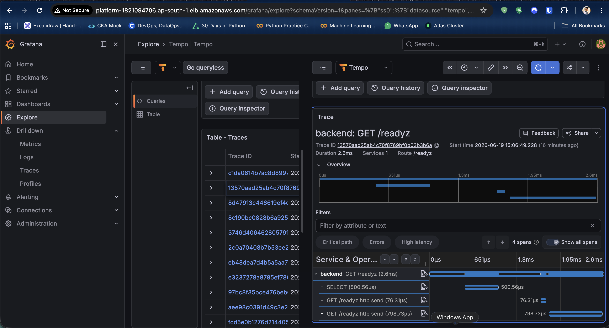

### Logs (Loki)

Application and platform logs shipped by Promtail into Loki, explored by namespace.

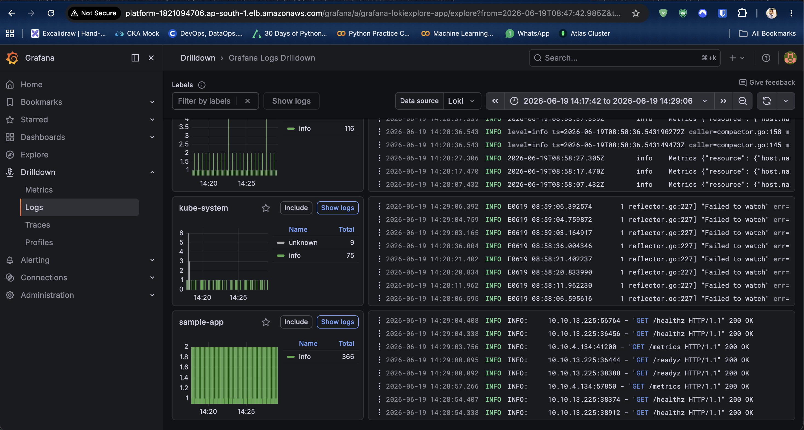
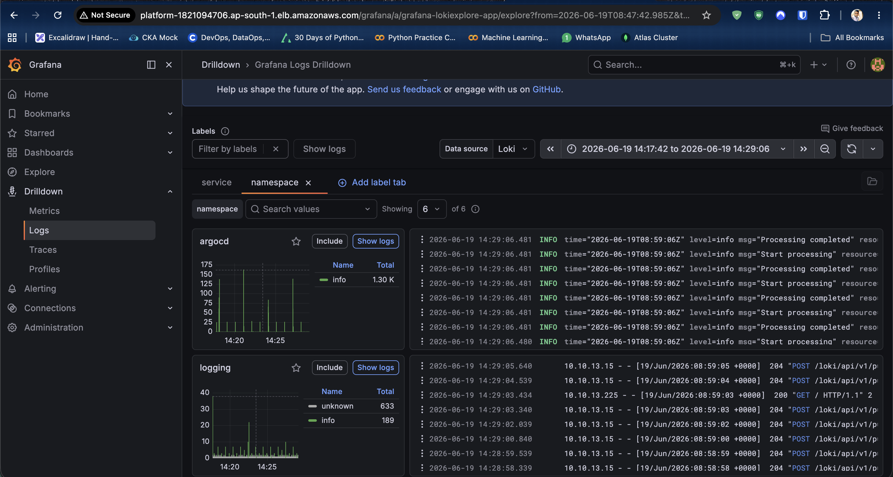

### Metrics (Prometheus + Grafana)

Cluster, node, pod, and workload views from kube-state-metrics and node-exporter.

| | |
|---|---|
| 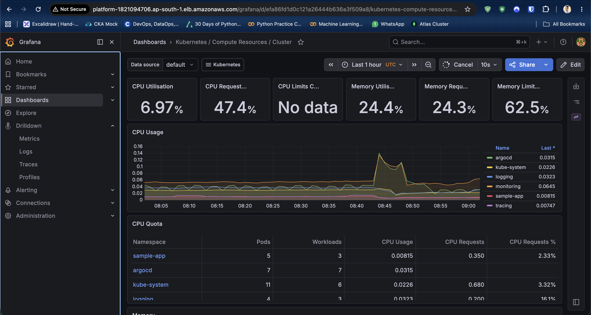 | 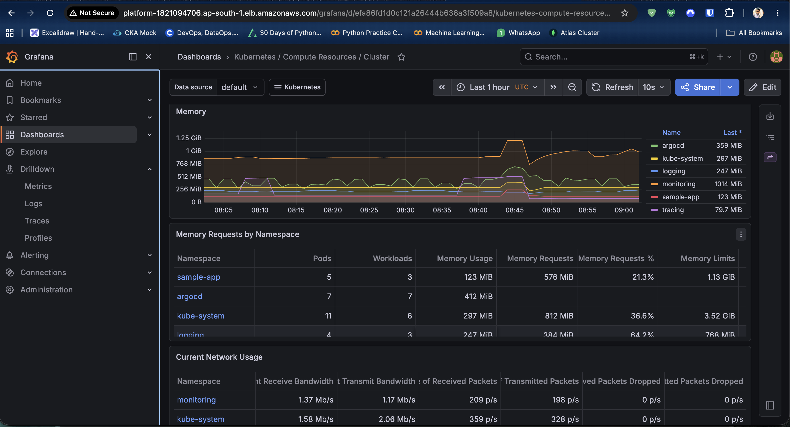 |
| 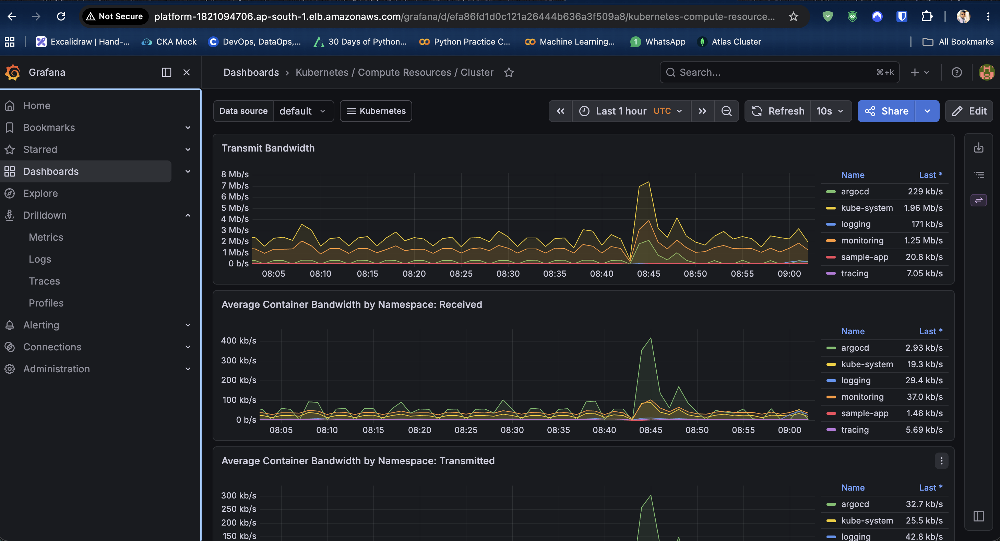 | 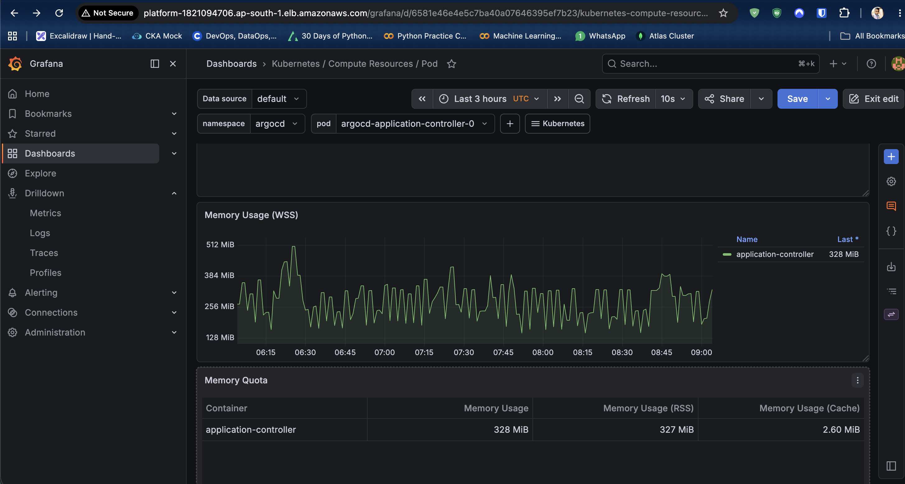 |
| 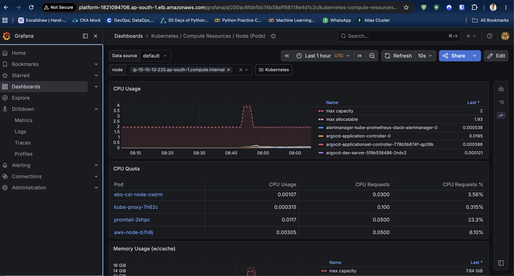 | 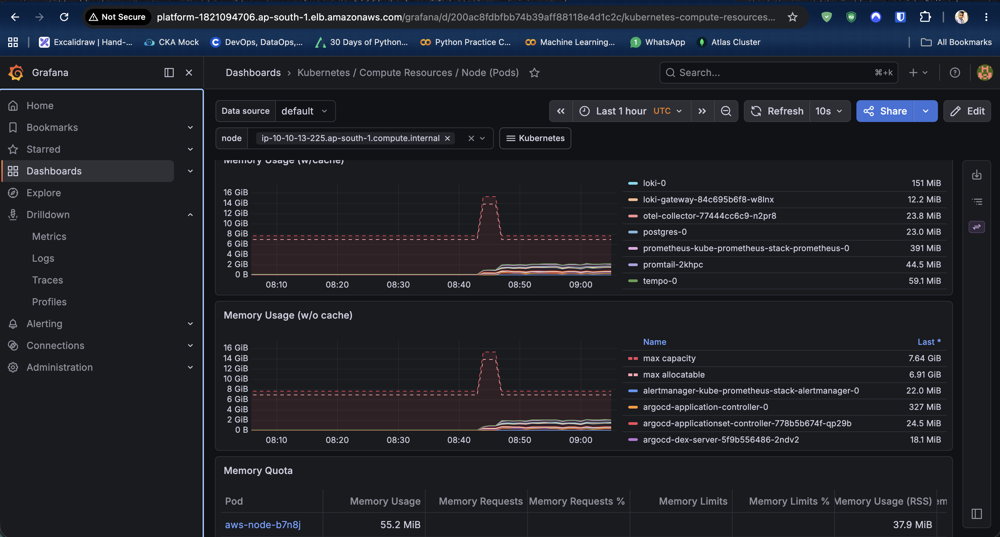 |
| 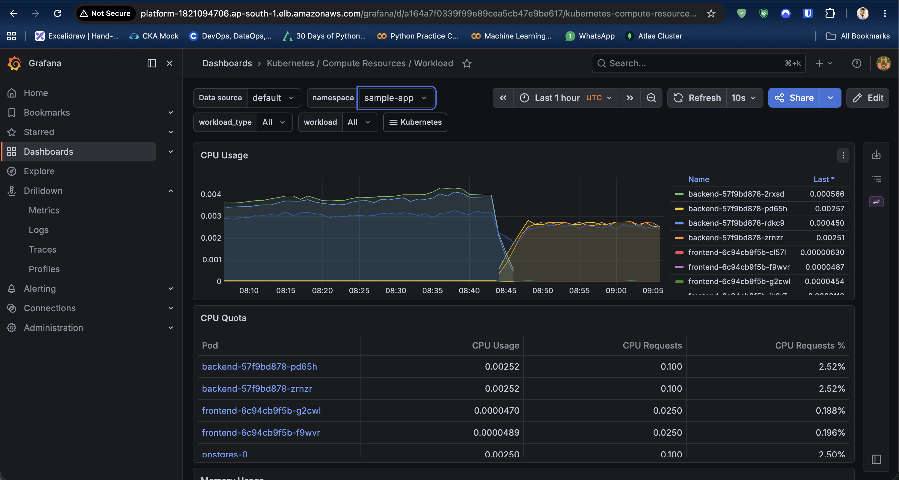 | 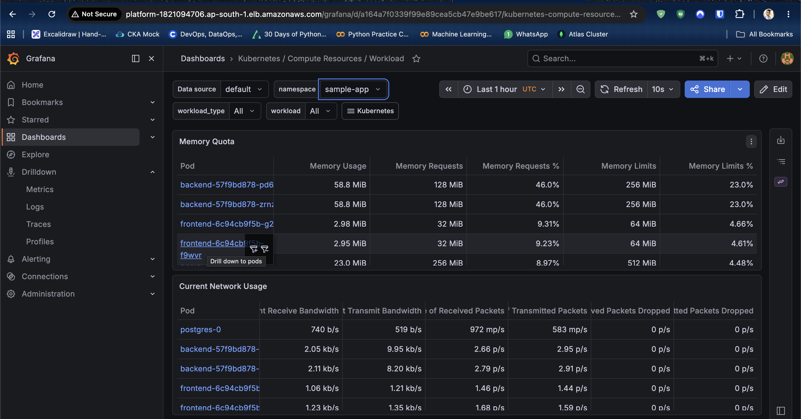 |

## Quick start

```bash
# 1. Provision the platform (Phase 1). Pick an environment
cd terraform/environments/staging   # or environments/production
terraform init && terraform apply
aws eks update-kubeconfig --region "$(terraform output -raw region)" \
  --name "$(terraform output -raw cluster_name)"

# 2. Deploy everything via GitOps (Phase 2 onward)
#    (push your fork, replace OWNER placeholders, build and push images first;
#     full steps in docs/PHASE2.md)
./argocd/bootstrap/bootstrap.sh
```

From there, ArgoCD installs every platform component in dependency order using sync
waves. The per-phase documents under `docs/` cover deployment, verification, and the
design reasoning for each layer.

## Repository structure

```
terraform/
  modules/platform/        Reusable Phase 1 module: VPC, EKS, node groups, IRSA, Route53, default StorageClass
  environments/staging/    Composition: SPOT, single NAT, single AZ (cost-optimised)
  environments/production/ Composition: ON_DEMAND, NAT per-AZ, 3 AZ (high availability)
  shared/                  Account level resources applied once (ECR registry)
app/          Sample application source (FastAPI backend, React frontend)
helm/         Helm charts: postgres, backend, frontend
argocd/       GitOps: AppProject, app-of-apps root, child Applications, bootstrap
prometheus/   kube-prometheus-stack values (Prometheus, Alertmanager, Grafana)
loki/         Loki values            otel/      OpenTelemetry Collector values
tempo/        Tempo values           grafana/   Provisioned dashboards and data sources
slo/          SLI/SLO and error-budget recording rules
alerts/       Multi-window burn-rate alert rules
chaos/        LitmusChaos experiments (run manually, not GitOps-synced)
ingress/      Shared ALB ingress for the platform UIs
docs/         Per-phase documentation and screenshots
```

## Notable design decisions

- **One reusable Terraform module, two compositions.** Staging and production share the
  same module but differ only in cost versus availability trade-offs. Each environment
  keeps its own remote state (a distinct S3 key, see each env's `backend.tf.example`).
- **Everything through GitOps.** No manual `kubectl apply` of platform components. The
  root ArgoCD Application owns the rest, with automated self-heal and prune, so the
  cluster always matches Git. A small number of inherently sensitive or one-shot actions
  (the Slack webhook Secret, the shared ALB ingress that embeds an IP allowlist, and the
  chaos experiments) are applied by hand on purpose and documented as such.
- **Recording rules as a single source of truth.** SLIs, SLO targets, and error budgets
  are precomputed once, so dashboards and alerts can never disagree on the numbers.
- **No secrets in Git.** The Slack webhook is read from a mounted Secret via
  `slack_api_url_file`, and AWS access uses IRSA rather than static keys.
- **One shared load balancer.** Grafana, Prometheus, Alertmanager, and the sample app are
  exposed through a single ALB using the AWS Load Balancer Controller IngressGroup
  feature with path-based routing, which keeps cost down versus one ALB per service.

> `production` defaults to high availability but ships with the API endpoint CIDR as a
> `203.0.113.0/24` placeholder, so replace it before applying.
